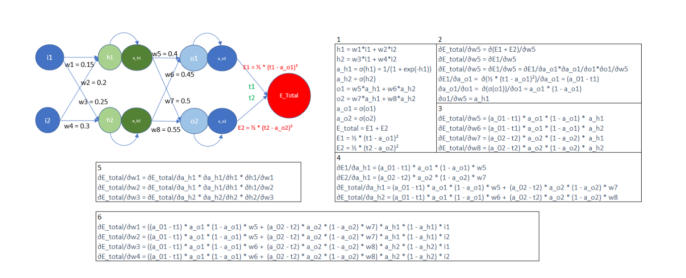
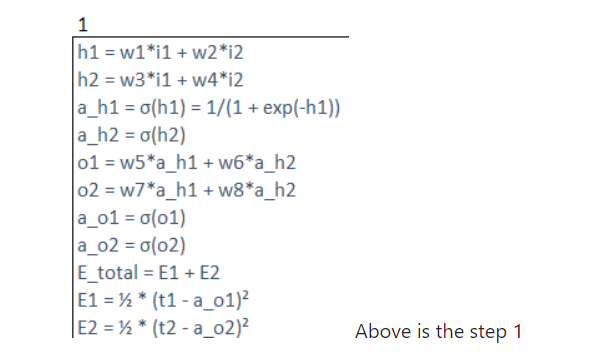
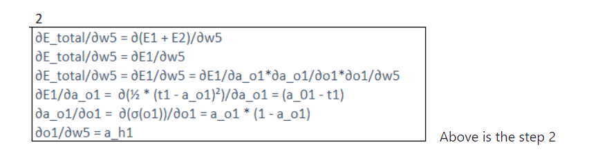
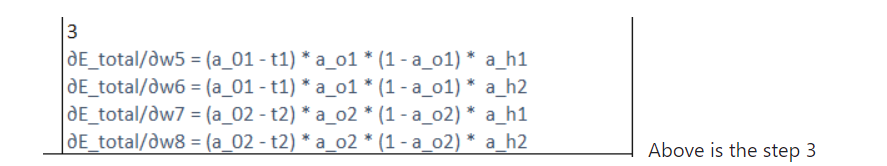
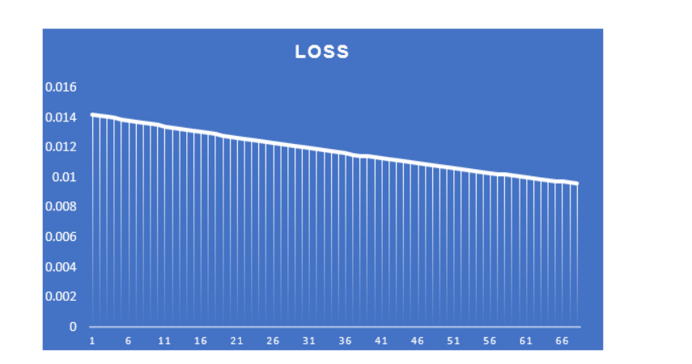
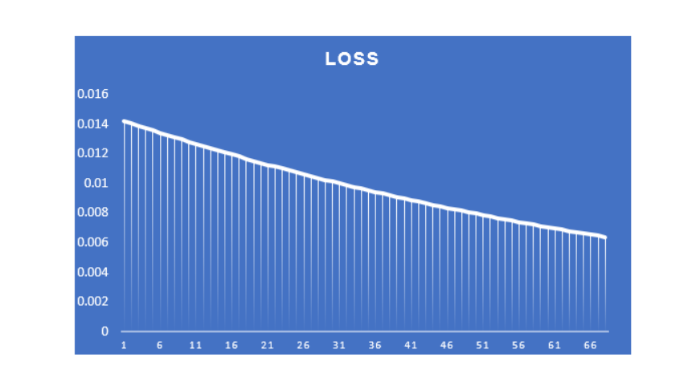
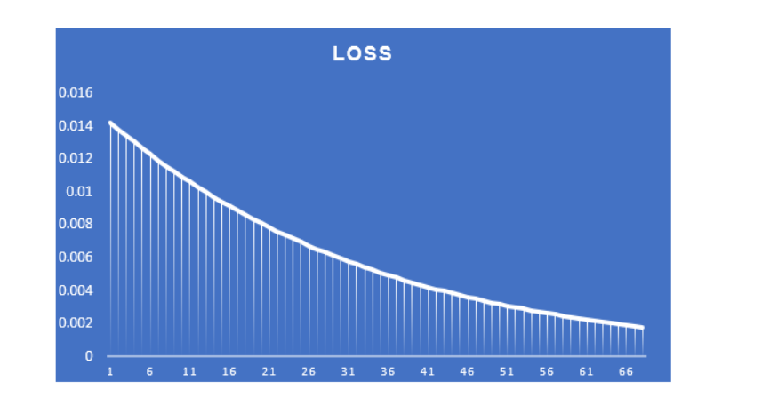
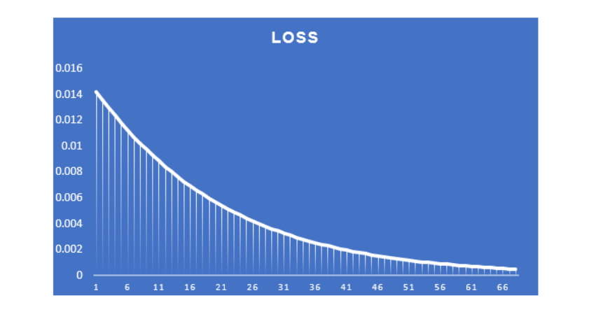
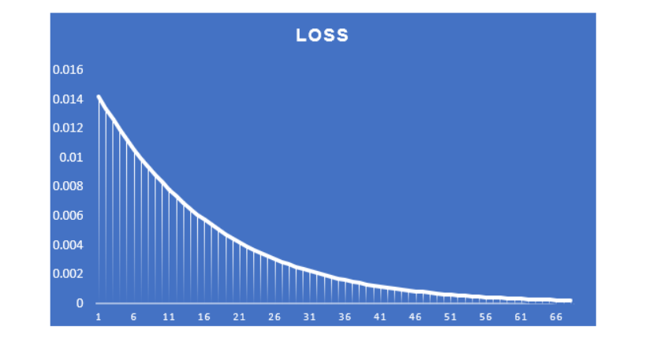
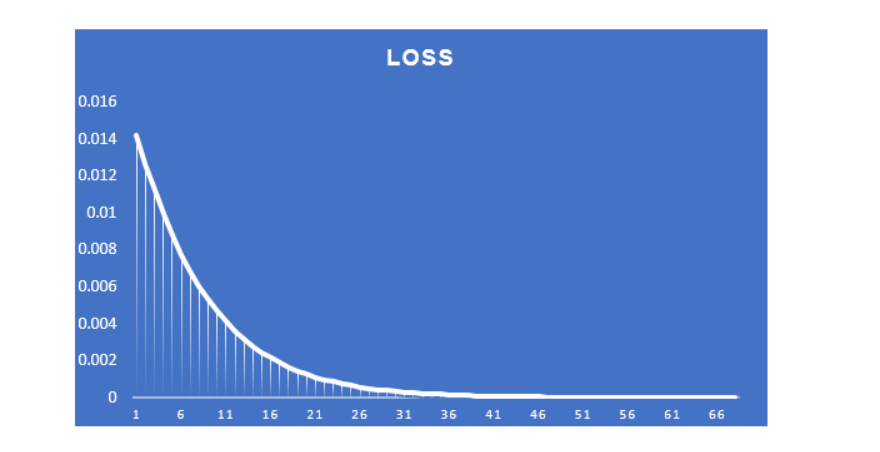

Above is the image of backpropagation calculation 

Above is the step 1 

Below is the line by line description of step 1

1) For calculating h1,weights 1 is being multiply with input 1 + weights 2 is being multiply with input 2
2) For calculating h2,weights 3 is being multiply with input 1 + weights 4 is being multiply with input 2
3) For calculating a_h1, we will apply sigmoid function to h1
4) For calculating a_h2, we will apply sigmoid function to h2
5) Same for calculating o1 we will multiply weights 5 with a_h1 + weights 6 with a_h2
6) Same for calculating o2 we will multiply weights 7 with a_h1 + weights 8 with a_h2
7) For calculating a_o1 we will apply sigmoid function to o1
8) For calculating a_o2 we will apply sigmoid function to o2
9) For calculating E_total we will sum E1 and E2

Above is the step 2

In Step 2, we will calculate derivative of E_total wrt to derivative of weight 5, for calculating E_total we have to calculate derivative of E1 and E2 wrt to weight 5. but DE1( Derivative of E1 ) is dependent on W5 and DE2 is not dependent on W5

Above is the step 3

In Step 3, we will calculate Derivative of E_Total wrt to W5,W6,W7 and W8

Above is the loss graph when the learning rate is set to 0.1. When epochs goes to 66, the loss decreasing speed gets reduced

Above is the loss graph when the learning rate is set to 0.2. When epochs goes to 66, the loss is good as compared to 0.1 learning rate

Above is the loss graph when the learning rate is set to 0.3. When epochs goes to 66, the loss is even good as compared to 0.1 and 0.2 learning rate

Above is the loss graph when learning rate is set 0.8

Above is the loss graph when learning rate is set 1

Above is the loss graph when learning rate is set 2

