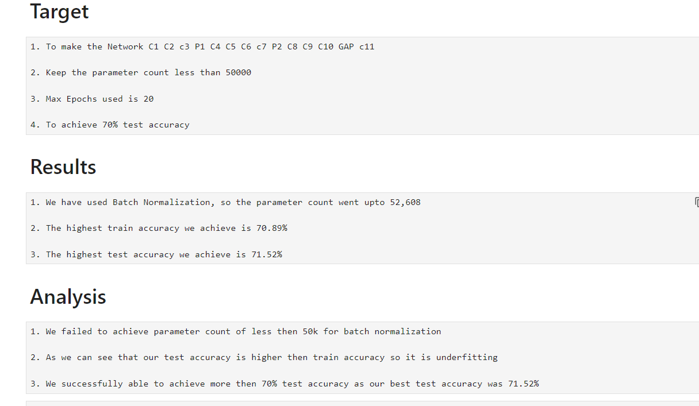
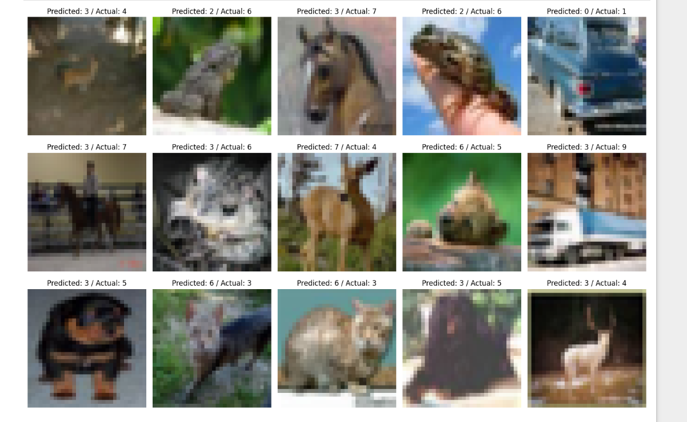
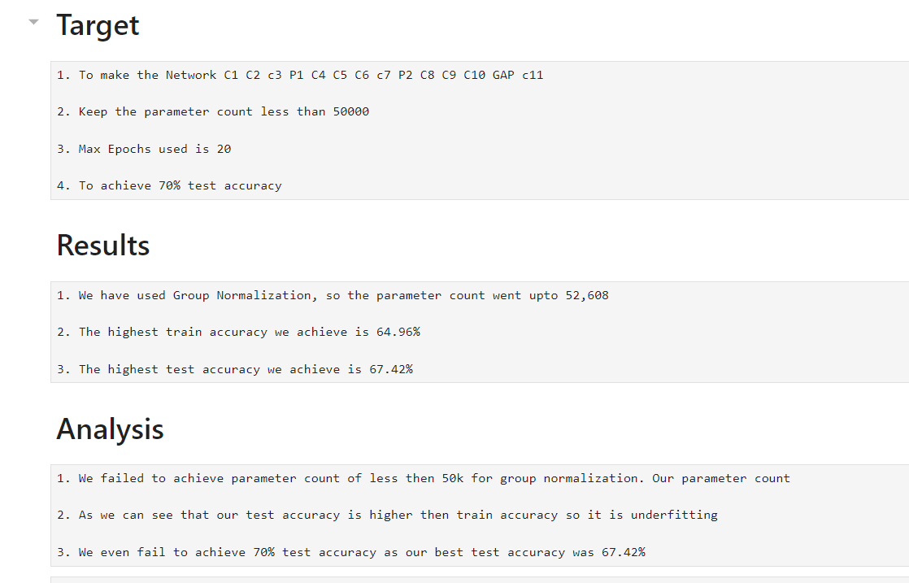
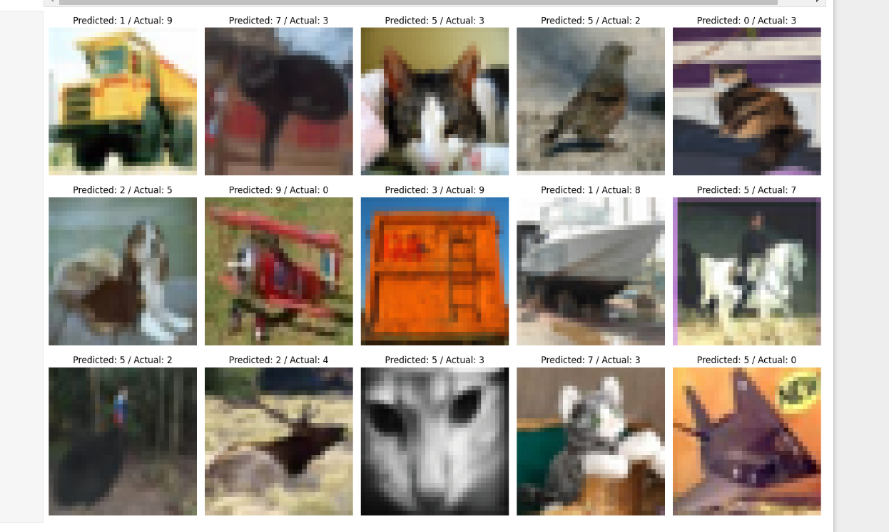
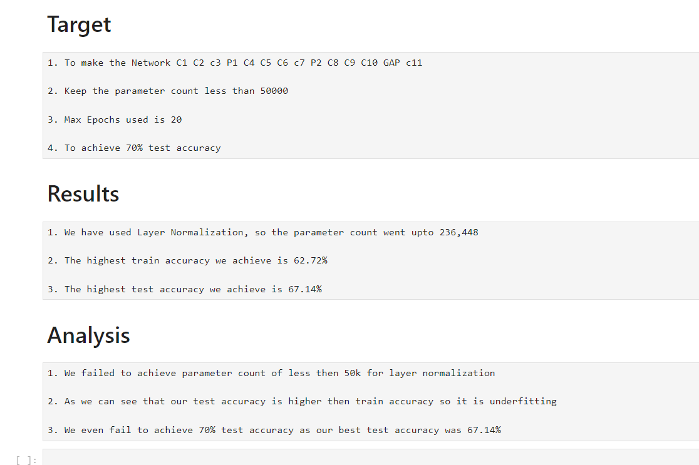
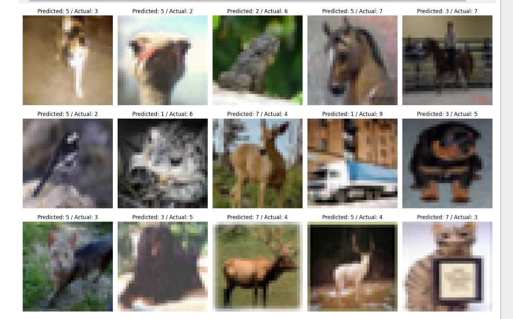

## This is ERA V2 Assignment No 8. This assignment is about implementing normalization techniques which we have studied from the session
## Our task is to make a 3 different models with Batch Normalization, Group Normalization and Layer Normalization

## In this assignment, we have changed our dataset to CIFAR10 from MNIST
#### CIFAR10 is an established computer-vision dataset used for object recognition. It is a subset of the 80 million tiny images dataset and consists of 60,000 32x32 color images containing one of 10 object classes, with 6000 images per class.

### Our task are to make a network in such as like
1. C1 C2 c3 P1 C4 C5 C6 c7 P2 C8 C9 C10 GAP c11
2. Keep the parameter count less than 50000
3. Max Epochs is 20
4. We have to make 3 versions( Batch Normalization, Group Normalizationa and Layer Normalization ) of the above code in such as that we achieve 70% accuracy
5. Share these details
   
     i)  Training accuracy for 3 models
   
     ii) Test accuracy for 3 models

6. Find 10 misclassified images for the BN, GN and LN model, and show them as a 5x2 image matrix in 3 separately annotated images.

# For Batch Normalization

In the above image we can see that the highest accuracy we achieve was 71.52% and maximum parameter count we achieve was 52,608

In above image, we can see 10 misclassified images for the Batch Normalization

##### My Findings for Batch Normalization
1. We get higher and faster accuracy in Batch Normalization
2. The model convergence faster when used Batch Normalization
3. Using basic model with Batch Normalization we get good accuracy both(train and test)
4. Final Receptive Field we get is 55

# For Group Normalization

In the above image we can see that the highest accuracy we achieve was 67.42% and maximum parameter count we achieve was 52,608

In above image, we can see 10 misclassified images for the Group Normalization

##### My Findings for Group Normalization
1. We get lessser accuracy in Group Normalization as compared to Batch Normalization
2. The model does not convergence faster when used Group Normalization

# For Layer Normalization

In the above image we can see that the highest accuracy we achieve was67.14% and maximum parameter count we achieve was 236,448

In above image, we can see 10 misclassified images for the Layer Normalization

##### My Findings for Layer Normalization
1. We get lessser accuracy in Layer Normalization as compared to Batch Normalization and Group Normalization
2. The model convergence slower when used Layer Normalization
3. In this model our parameter count also got tremendously increase from 52,608 to 236,448

