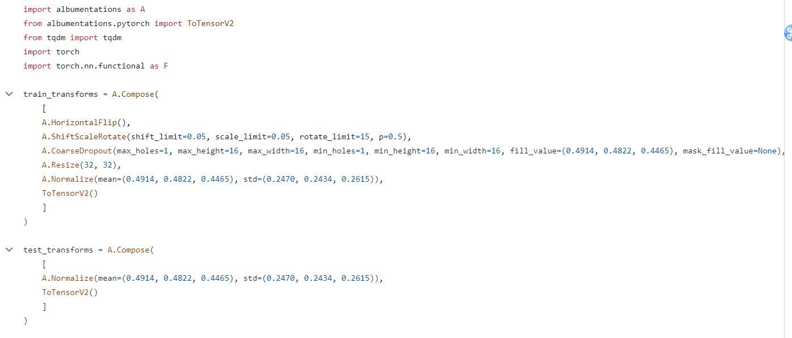
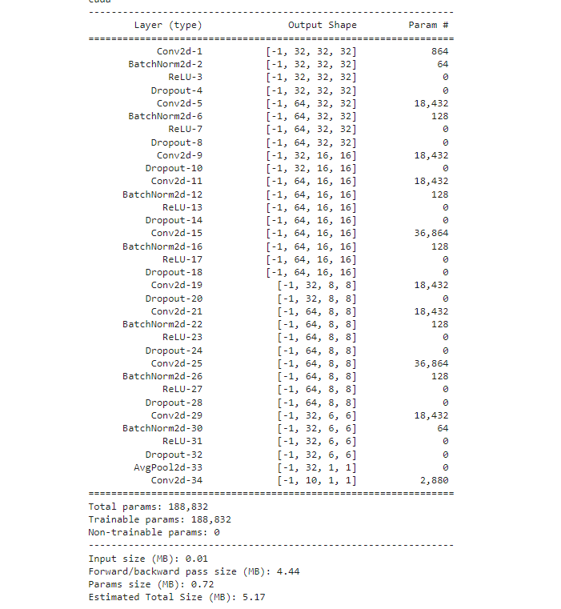
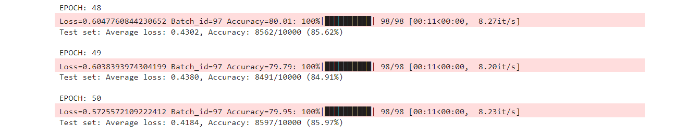

## This is Assignment 9 of ERA V2 Batch

#### models.py :-  File contains model architecture. We are imported this model in our mail S9-Assignment.ipynb file

#### utils.py :- This File contains Implementation of Albumentation Library with horizontal flip, shiftScaleRotate, coarseDropout and it contains loss function of train and test

#### S9-Assignment.ipynb :- File contains the code of running the model, visualizing the datasets

#### The assignment which we was to build was using CIFAR10 Dataset and build a network ....
1) That has the architecture to C1C2C3C40 (No MaxPooling, but 3 convolutions, where the last one has a stride of 2 instead)

2) Total RF must be more than 44

3) One of the layers must use Depthwise Separable Convolution

4) One of the layers must use Dilated Convolution

5) Use GAP (compulsory):- add FC after GAP to target #of classes (optional)

6) Use albumentation library and apply:
    i) horizontal flip
    ii) shiftScaleRotate
    iii) coarseDropout (max_holes = 1, max_height=16px, max_width=16, min_holes = 1, min_height=16px, min_width=16px, fill_value=(mean of your dataset), mask_fill_value = None)

7) Achieve 85% accuracy, as many epochs as you want. Total Params to be less than 200k.

And the results which we got is

## Results

In the above image, we can see that i have applied transformations using albumentation library

In the above image, we can see that i have build a model architecture with parameters less than 200k which is 188,832

In the above image, you can see that i got highest accuracy of 85.97% at 50th epoch

